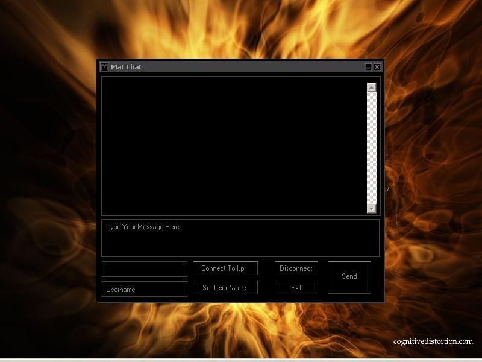



## AA Winsock Chat \( Client & Server \)

### Description

this is a p2p chat application that uses winsock,

this is a good example of how client server aplications work.

every line of code is explained to give you the best explination of how it works.
 
### More Info
 
this will aleart your firewall, if you are using windows xp firewall it will block it without warning, to test it conect to your self open the server and click connect, then on the client, connect to i.p "127.0.0.1"

enjoy

             |
---                |---
**Submitted On**   |2001-10-09 21:34:56
**By**             |[matthew lampitt](https://github.com/Planet-Source-Code/PSCIndex/blob/master/ByAuthor/matthew-lampitt.md)
**Level**          |Intermediate
**User Rating**    |4.2 (21 globes from 5 users)
**Compatibility**  |VB 5\.0, VB 6\.0
**Category**       |[Complete Applications](https://github.com/Planet-Source-Code/PSCIndex/blob/master/ByCategory/complete-applications__1-27.md)
**World**          |[Visual Basic](https://github.com/Planet-Source-Code/PSCIndex/blob/master/ByWorld/visual-basic.md)
**Archive File**   |[AA\_Winsock16588510152003\.zip](https://github.com/Planet-Source-Code/matthew-lampitt-aa-winsock-chat-client-server__1-49232/archive/master.zip)

